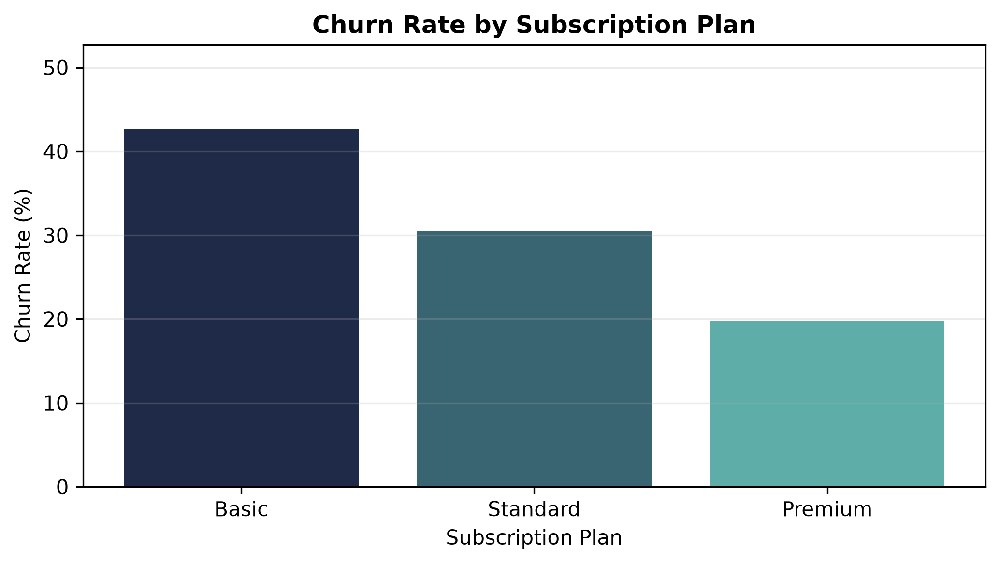

# Churn Analysis & Customer Intelligence

An end-to-end subscription churn analysis built in Python and SQL — from raw SQLite tables through cleaning, feature engineering, and 14 KPIs, to a visual layer and a prioritised set of retention actions.

**Stack:** Python (pandas, NumPy, matplotlib, seaborn) · SQLite · Jupyter
**Deliverable:** [`notebooks/churn_analysis.ipynb`](notebooks/churn_analysis.ipynb)

---

## Headline Results

| Metric | Value |
|---|---|
| Churn rate | **28.57%** (6 of 21 customers) |
| Retention rate | 71.43% |
| Revenue at risk | **18.68% of MRR** ($73.94 of $395.79) |
| Strongest churn driver | **Contract type** — Monthly 55.6% vs Annual 8.3% |
| Highest-risk plan | **Basic** — 60.0% churn vs Premium 14.3% |
| Support signal | Escalation ↔ churn correlation of **0.77** |
| Average tenure | 1,355 days (~3.7 years) |
| ARPU | $18.85 |

**The one-line takeaway:** churn is not spread evenly across the customer base — it is concentrated in month-to-month contracts on the entry-tier plan, and it is preceded by support escalations.

---

## Contents

1. [Ask — the business problem](#1-ask--the-business-problem)
2. [Prepare — the data](#2-prepare--the-data)
3. [Process — cleaning and integrity](#3-process--cleaning-and-integrity)
4. [Analyze — KPIs](#4-analyze--kpis)
5. [Share — visual findings](#5-share--visual-findings)
6. [Act — recommendations](#6-act--recommendations)
7. [Scope & data notes](#scope--data-notes)
8. [Repository structure](#repository-structure)
9. [Running this project](#running-this-project)

---

## 1. Ask — the business problem

A subscription streaming business is losing customers and wants to know **who is leaving, why, and what it costs** — so that limited retention budget can be aimed at the segments where it will actually move the number.

The analysis was built to answer five questions:

1. What is the overall churn rate, and what does it cost in recurring revenue?
2. Which customer segments churn most — by plan, contract, acquisition channel, geography?
3. Is there a behavioural early-warning signal that appears *before* a customer cancels?
4. How long do customers stay, and how does that differ between those who leave and those who stay?
5. Which customers should a retention team contact first?

---

## 2. Prepare — the data

The source is a SQLite database (`data/raw/customer_churn.db`) containing three related tables joined on `customerid`:

| Table | Rows | Contents |
|---|---|---|
| `db_customer` | 21 | Demographics — name, DOB, gender, state, country |
| `db_subscription` | 21 | Plan and contract type, start/renewal/cancellation dates, monthly charges, CLTV, churn score |
| `db_support` | 9 | Support tickets — complaint date, escalation status, CSAT score |

**Scale:** 21 customers, with cancellations observed between February and November 2024. This is a compact dataset, and the analysis is written accordingly — findings on segments containing only two or three customers are reported as directional and labelled as such throughout. See [Scope & data notes](#scope--data-notes).

---

## 3. Process — cleaning and integrity

Each table was cleaned independently before joining.

**Customer table**
- Renamed `name` → `customer_name` for clarity in the merged frame
- Dropped `interests` and `pincode` (entirely or near-entirely empty)
- Converted `dob` from text to datetime
- Standardised inconsistent gender values (`Men`→`Male`, `Women`→`Female`)
- Filled 3 missing `country` values by building a state→country lookup from rows where country was already known — recovering the data rather than dropping the rows

**Subscription table**
- Converted three date columns from text to datetime
- Fixed a raw-data spelling error in `subscription_type` (`Refferal` → `Referral`) so the category didn't split in aggregations
- Retained nulls in `cancellation_date` / `cancellation_reason` — these are *expected*, not missing: 15 customers are still subscribed

**Support table**
- Dropped junk columns (`col_1`, `comment`)
- Converted `complaint_date` to datetime

### The join fan-out — and the fix

Merging the three tables produced **23 rows from 21 customers.**

The support table held 9 rows for only 7 customers, because two customers had filed more than one ticket. Joining on `customerid` caused those one-to-many matches to *fan out*, silently duplicating subscription rows and inflating every downstream metric — revenue, churn counts, averages.

The fix was to aggregate support to one row per customer before joining:

- Added a `complaint_count` feature via `groupby().transform('count')` so the repeat-contact information was preserved rather than discarded
- Kept each customer's **most recent** ticket (`sort_values` + `drop_duplicates(keep='last')`), because the latest interaction best reflects their current escalation status and satisfaction

The corrected merge returns exactly 21 rows. Both the broken and fixed merges are kept in the notebook as a before/after record.

*This is the kind of defect that does not raise an error — it just quietly makes every number wrong. Validating row counts across a join is the check that catches it.*

### Feature engineering

| Feature | Definition |
|---|---|
| `churn_flag` | 1 if `cancellation_date` is present, else 0 |
| `complaint_count` | Number of support tickets filed per customer |
| `escalation_flag` | Numeric encoding of `escalations` for correlation analysis |
| `churn_risk` | `churn_score` bucketed into Low / Medium / High via `np.select` |

---

## 4. Analyze — KPIs

Fourteen KPIs were computed on the cleaned, merged dataset. Each carries a short written interpretation in the notebook.

| # | KPI | Result |
|---|---|---|
| 1 | Churn rate | 28.57% |
| 2 | Retention rate | 71.43% |
| 3 | Churn by plan type | Basic 60.0% · Standard 22.2% · Premium 14.3% |
| 4 | **Churn by contract type** | **Monthly 55.6% · Annual 8.3%** |
| 5 | Churn by acquisition channel | With revenue and customer count per channel |
| 6 | Churn, revenue & size by state | Combined view to weight churn by revenue exposure |
| 7 | ARPU | $18.85 |
| 8 | Total revenue & CLTV | MRR $395.79 · total CLTV $17,294 · avg CLTV $823.52 |
| 9 | Revenue at risk | $73.94/mo — **18.68% of MRR** |
| 10 | Average tenure | 1,355 days — churned 773 vs retained 1,588 |
| 11 | Average complaints per user | 0.43 |
| 12 | Escalation rate | 19.05% of all customers — **57.14% of support tickets** |
| 13 | Escalation ↔ churn correlation | 0.77 |
| 14 | Churn risk tiers | Low 13 · Medium 2 · High 6 |

Two of these are worth calling out for how they are defined:

- **Revenue at risk** is expressed as a share of MRR, not just a dollar total. The percentage is the figure that generalises.
- **Escalation rate** is reported on two denominators. Across all customers it is 19.05%, but only 7 customers contacted support at all — so among actual tickets, **57.14% required escalation**. That second number is the operational one.

---

## 5. Share — visual findings

### Churn by contract type — the primary finding


Monthly-contract customers churn at **55.6%** versus **8.3%** on annual contracts — a ~7× difference, and the single clearest segmentation in the dataset. Annual customers are committed for a longer horizon and materially stickier.

### Churn by subscription plan



Churn concentrates in the entry tier: **Basic 60.0%**, Standard 22.2%, Premium 14.3%. Basic also holds the fewest customers and the smallest revenue share, so the issue is one of converting and retaining the low end rather than protecting top accounts.

### Correlation between churn-related metrics


Churn is most strongly associated with churn score (0.86) and **escalation status (0.77)**. The escalation relationship is the actionable one: a support escalation is an observable event that occurs *before* cancellation, which makes it usable as a trigger. CSAT moves inversely with escalation (−0.78), as expected.

*The churn-score relationship is read with caution — see [Scope & data notes](#scope--data-notes).*

### Churn by state


Karnataka (100%), Meghalaya (66.7%) and Telangana (50%) show the highest rates, but each contains only two or three customers. These are treated as directional signals for further investigation, not as geographic conclusions.

### Monthly churn trend


Cancellations were intermittent across 2024, peaking at two in September. Months with zero churn are retained so the trend is not visually compressed. With six total churn events, this is descriptive — it is not evidence of seasonality.

---

## 6. Act — recommendations

**1. Target month-to-month subscribers for annual conversion.**
The largest single lever available. Offer discounted annual upgrades or loyalty incentives ahead of renewal dates, prioritising monthly customers who also sit on the Basic plan — the intersection of the two highest-churn segments.

**2. Audit the Basic-plan experience.**
At 60% churn, Basic is the weakest tier. Review pricing, included content, and onboarding to establish whether the plan is failing to deliver enough value to justify renewal, or whether it is attracting customers who were never a strong fit.

**3. Treat support escalations as a retention trigger.**
With a 0.77 correlation to churn, escalation is the most actionable early-warning signal in the data. Route escalated tickets to proactive retention follow-up rather than closing them at resolution. That 57% of all tickets escalate at all suggests first-contact resolution is itself worth investigating.

**4. Build a prioritised outreach list.**
Combine contract type, plan tier, escalation history, and CLTV to rank customers for intervention — targeting high-value accounts showing risk signals ahead of low-value ones.

**5. Close the CSAT coverage gap.**
Satisfaction scores exist for only 7 of 21 customers, all of whom contacted support. Capturing CSAT across the full base — including customers who never raise a ticket — would enable satisfaction to be tested as a churn predictor rather than assumed.

**6. Do not act on state-level results yet.**
Geographic churn rates rest on two-to-three customer segments. Collect more data before allocating regional retention or marketing spend.

---

## Scope & data notes

Methodological decisions a reader should know about, and how they are handled in the analysis:

**Dataset size.** 21 customers, 6 churn events. Aggregate metrics (churn rate, ARPU, revenue at risk) are exact for this population. Segment-level rates on small groups are reported as directional and labelled inline wherever they appear, and no statistical significance is claimed anywhere in the notebook.

**`churn_score` is a provided field, not a model output built here.** Its risk tiers separate the outcome perfectly — all 6 high-risk customers churned, all 15 low/medium customers were retained. That pattern is characteristic of a score generated with knowledge of the outcome, so `churn_score` is used to **demonstrate segmentation method** rather than as validated evidence of predictive power. Its 0.86 correlation with churn is treated as an artefact of dataset construction. The independently observable signals — contract type, plan tier, escalation status — carry the analytical conclusions.

**Reproducibility.** Tenure for active customers is measured to a fixed `AS_OF_DATE` of 2025-12-31, the end of the observation window, rather than to the current date. This keeps the figure stable across re-runs; using `today` would cause reported tenure to drift upward indefinitely.

**Expected nulls are preserved, not imputed.** Missing `cancellation_date` values mean a customer is still active, and missing support fields mean no ticket was ever filed. Both are information, and both are kept as such.

---

## Repository structure

```
churn-analysis/
├── data/
│   ├── raw/
│   │   ├── customer_churn.db              # source SQLite database
│   │   └── customer_churn_data_raw.xlsx   # source Excel export
│   └── processed/
│       └── exported_churn_data.csv        # cleaned, merged output (regenerated on run)
├── notebooks/
│   └── churn_analysis.ipynb               # full analysis
├── reports/
│   └── figures/                           # exported charts
├── requirements.txt
└── README.md
```

---

## Running this project

```bash
git clone https://github.com/ShayanYawarBhatti/churn-analysis.git
cd churn-analysis

python3 -m venv .venv
source .venv/bin/activate        # Windows: .venv\Scripts\activate

pip install -r requirements.txt
jupyter notebook notebooks/churn_analysis.ipynb
```

Run all cells top to bottom. The notebook regenerates `data/processed/exported_churn_data.csv` and every figure in `reports/figures/`.

---

## Notebook structure

| Section | Contents |
|---|---|
| 1. Setup & Data Import | SQLite connection, table discovery, load to DataFrames |
| 2. Data Cleaning | Type fixes, renames, category standardisation, missing-value recovery |
| 3. Feature Engineering & Merge | `churn_flag`, join integrity check, fan-out fix, merge |
| 4. Data Analysis | 14 KPIs with written interpretation |
| 5. Data Visualizations | 5 charts (matplotlib + seaborn), exported to `reports/figures/` |
| 6. Pivot Table Analysis | Multi-metric subscription plan summary |
| 7. Business Insights & Recommendations | Findings translated into retention priorities |
