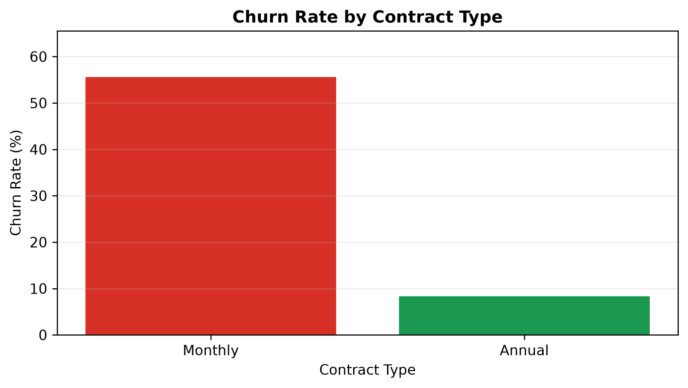
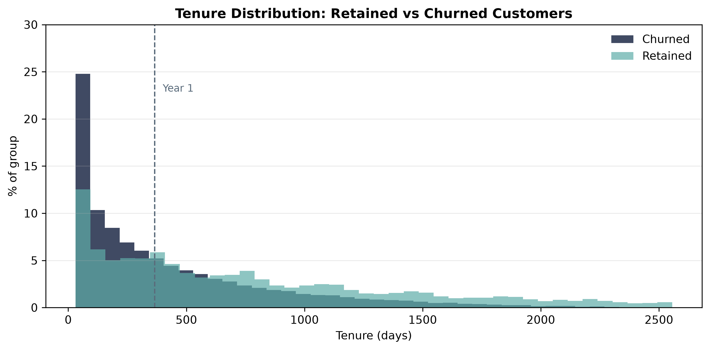
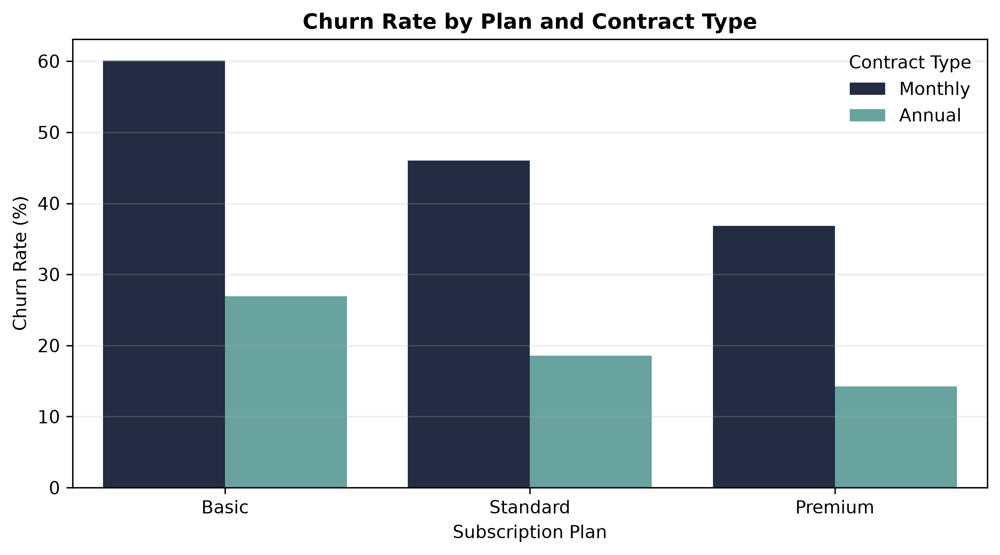
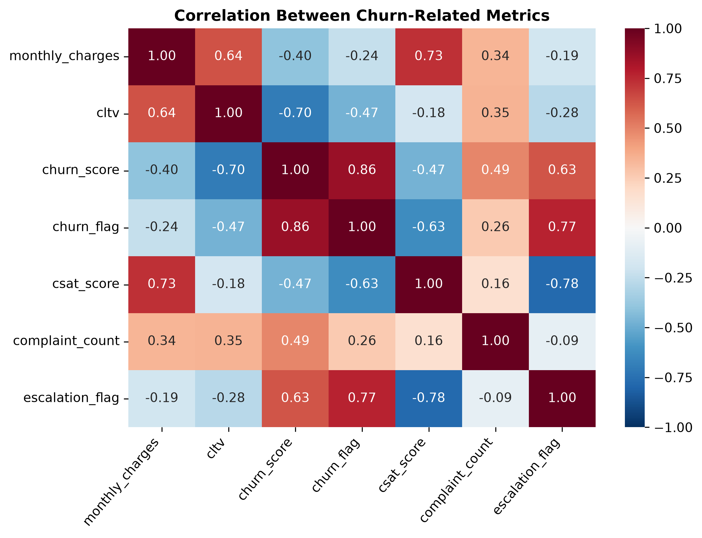
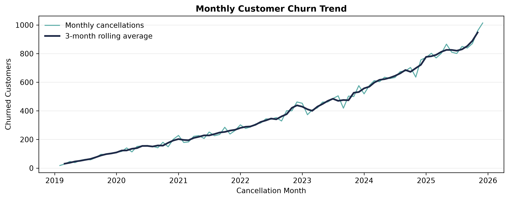
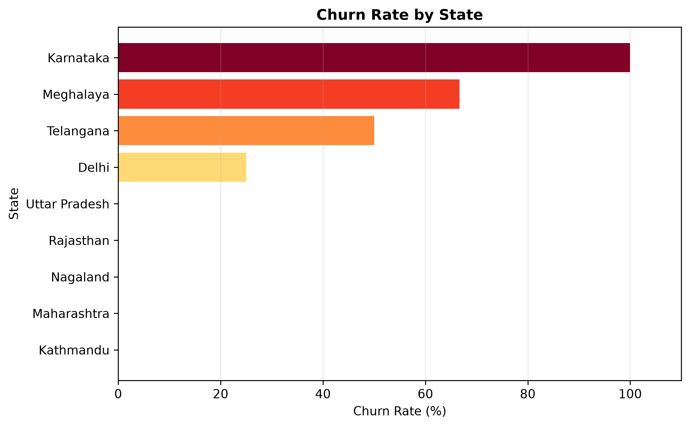

# Customer Churn & Retention Intelligence

**End-to-end churn analysis for a 100,000-subscriber streaming business — identifying who leaves, why, and what it costs.**

Nearly one in three subscribers cancels, taking **$433,107 in monthly charges** with them — 29% of the total. That loss is not spread evenly. It concentrates in a profile defined by contract type, plan tier and acquisition channel — all recorded at signup — and it is preceded by a support ticket the business already logs. **Both signals are actionable before the customer is lost.**

The analysis runs end to end: SQL extraction, data cleaning, feature engineering, 14 KPIs, seven visualisations, and a ranked retention plan.

`Python` · `pandas` · `NumPy` · `SQL / SQLite` · `matplotlib` · `seaborn` · `Jupyter`

**Deliverables** — [Analysis notebook](notebooks/churn_analysis.ipynb) · [Business report (PDF)](reports/Subscription_Retention_Analysis_Report.pdf)

---

## Headline Results

| Metric | Value |
|---|---|
| Subscriber base | **100,000** customers · $1.06M active MRR (~$12.7M annualised) |
| Churn rate | **32.68%** (32,676 customers) |
| Revenue lost | **$433,107/mo — 28.98% of total monthly charges** (~$5.20M simplified annualised run-rate) |
| Strongest driver | **Contract type** — Monthly 50.80% vs Annual 20.10% |
| Worst segment | **Basic on a monthly contract — 60.09% churn** |
| Best segment | Premium on an annual contract — 14.22% churn |
| Behavioural signal | Churn climbs 29.09% → 43.59% → 67.77% with support escalation |
| Retention window | **58.5% of all churn occurs in the first year** |

> **The finding that matters:** churn is not diffuse. It concentrates in month-to-month contracts on low-value plans in dense urban markets, and it is preceded by a support ticket. Every one of those signals is observable *before* the customer leaves — three at signup, one in the support queue.

---

## How This Analysis Is Structured

The project follows a six-phase analytical workflow, and this README is organised the same way.

| Phase | Question it answers | Section |
|---|---|---|
| **Ask** | What is the business problem, and what would a useful answer look like? | [1](#1-ask--the-business-problem) |
| **Prepare** | What data exists, where does it come from, and what does it cover? | [2](#2-prepare--the-data) |
| **Process** | Is the data trustworthy, and what had to be fixed before analysis? | [3](#3-process--cleaning--data-integrity) |
| **Analyze** | What do the numbers say? | [4](#4-analyze--performance-baseline) |
| **Share** | What does the evidence look like, and what does it mean? | [5](#5-share--findings) |
| **Act** | What should the business actually do? | [6](#6-act--recommendations) |

Supporting material: [Methodology Notes](#methodology-notes) · [Reproducing This Analysis](#reproducing-this-analysis)

---

## 1. Ask — The Business Problem

A subscription streaming business is losing roughly a third of its customers and applies retention spend uniformly across the base — expensive, and largely wasted on customers who were never going to leave.

The commercial question is not "how do we reduce churn" in the abstract. It is **which customers to contact, in what order, and on what trigger.**

**Stakeholders:** retention and growth teams (who to target), product (why the entry tier underperforms), customer support (whether escalation is a churn driver), and finance (what the exposure is worth).

**The five questions this analysis was built to answer:**

- What is the churn rate, and what does it cost in recurring revenue?
- Which segments carry disproportionate risk — by plan, contract, channel, geography?
- Is there a behavioural signal that appears *before* a customer cancels?
- When in the customer lifecycle is risk concentrated?
- Which customers should a retention team contact first?

**What a useful answer looks like:** a ranked, actionable target list built on attributes the business already collects — not a model that requires new instrumentation.

---

## 2. Prepare — The Data

A SQLite database of three related tables joined on `customerid`:

| Table | Rows | Contents |
|---|---|---|
| `db_customer` | 100,000 | Demographics — name, DOB, gender, state, country |
| `db_subscription` | 100,000 | Plan, contract, dates, charges, lifetime value, churn score |
| `db_support` | 18,718 | Support tickets — date, escalation status, CSAT |

**Coverage:** 100,000 subscribers across 51 US markets, with subscriptions beginning January 2019 and cancellations observed through December 2025. Analysis as-of date: **31 December 2025**.

**Business context that shapes the analysis:** the company is growing. Annual signups rose from 5,664 in 2019 to 27,638 in 2025, which means the subscriber base skews young and cumulative churn varies by cohort exposure. This is accounted for explicitly in the findings rather than left to distort them.

**Data integrity assessed at the outset:** three tables, one join key, one known one-to-many relationship (support tickets), and several fields with missing or inconsistent values — all documented and handled in Process below.

> **Note on the data.** This is a **synthetic dataset**, generated to model realistic subscription behaviour: a front-loaded churn hazard, urbanisation-driven regional variation, seasonal signup patterns, price grandfathering across cohorts, and deliberate data-quality defects. It exists to demonstrate analytical method end-to-end. Every finding below is a genuine property of the data as analysed.

---

## 3. Process — Cleaning & Data Integrity

### Cleaning decisions

Each table was cleaned independently before joining.

**Customer** — renamed `name` → `customer_name`; dropped `interests` (87% empty) and `pincode` (100% empty); converted `dob` from text to datetime; consolidated inconsistent gender entries (`Men`→`Male`, `Women`→`Female`); recovered **1,728 missing country values** by deriving a state→country lookup from complete records rather than dropping the rows.

**Subscription** — converted three date columns from text; standardised a spelling inconsistency in the acquisition channel field (`Refferal` → `Referral`) that would otherwise have split the category across every aggregation.

**Support** — dropped empty columns; converted `complaint_date` to datetime.

Structural nulls were preserved as information: a missing cancellation date means an active customer, and a missing support field means a customer who never contacted support. Neither was imputed.

### The join fan-out

Merging the three tables produced **102,551 rows from 100,000 customers.**

The support table holds 18,718 tickets belonging to only 16,167 customers — 2,203 customers filed more than once. Joining on `customerid` caused these one-to-many matches to *fan out*, silently duplicating subscription records and inflating every downstream revenue and churn figure.

The fix aggregated support to one row per customer **before** the join:

- Created a `complaint_count` feature via `groupby().transform('count')`, preserving repeat-contact information rather than discarding it
- Retained each customer's **most recent** ticket (`sort_values` + `drop_duplicates(keep='last')`), since the latest interaction best represents current escalation status and satisfaction

The corrected join returns exactly 100,000 rows. Both the broken and corrected merges are kept in the notebook as a before/after record.

> This class of defect raises no error — it just quietly makes every number wrong. Validating row counts across a join is the check that catches it.

### Engineered features

| Feature | Definition |
|---|---|
| `churn_flag` | 1 where a cancellation date exists |
| `complaint_count` | Support tickets filed per customer |
| `escalation_flag` | Numeric encoding of escalation status |
| `tenure_days` | Days to cancellation, or to the fixed as-of date if active |
| `churn_risk` | `churn_score` banded Low / Medium / High via `np.select` |
| `support_state` | No contact / ticket filed / ticket escalated |

---

## 4. Analyze — Performance Baseline

Fourteen KPIs, each with a written interpretation in the notebook.

| # | KPI | Result |
|---|---|---|
| 1 | Churn rate | 32.68% |
| 2 | Retention rate | 67.32% |
| 3 | Churn by plan | Basic 42.69% · Standard 30.51% · Premium 19.80% |
| 4 | **Churn by contract** | **Monthly 50.80% · Annual 20.10%** |
| 5 | Churn by acquisition channel | Referral 45.81% · Paid 31.88% · Organic 26.71% |
| 6 | Churn by state | 51 markets, 15.52% – 41.90% |
| 7 | ARPU | $14.95 |
| 8 | Total revenue & CLTV | $1,494,659 total monthly charges · $1.06M active MRR · $31.18M CLTV · $311.82 avg |
| 9 | Revenue lost | **$433,107/mo — 28.98% of total monthly charges** |
| 10 | Average tenure | 642 days — retained 745 vs churned 430 |
| 11 | Complaints per user | 0.16 |
| 12 | Escalation rate | 6.38% of customers — **45.25% of support-contacting customers** |
| 13 | Support contact vs churn | 29.09% → 43.59% → 67.77% |
| 14 | Churn risk tiers | Low 18.92% · Medium 37.51% · High 62.84% |

Two definitions worth noting. **Revenue lost** leads with share of total monthly charges rather than a dollar total, because the percentage is what generalises. **Escalation rate** is reported on two denominators — across all customers it is 6.38%, but only 14,096 customers had a valid pre-outcome support contact, so among those customers it is 45.25%. That second figure is the operational one.

---

## 5. Share — Findings

### 5.1 Contract structure is the primary driver



Monthly-contract customers churn at **50.80%** against **20.10%** for annual — a 2.5× gap across 40,966 and 59,034 customers respectively.

The revenue consequence is disproportionate. Monthly contracts hold **38.4% of total monthly charges but account for 62.1% of all revenue lost to churn** ($269,154 of $433,107). Annual customers face a renewal decision once a year rather than twelve times, and contract terms are set by the business at the point of sale — making this the most controllable lever available.

### 5.2 Risk is front-loaded in the first year



Shown as a share of each group — necessary because the retained cohort is twice the size — the two distributions separate clearly. **38.6% of churned customers left within their first 180 days**, against 20.7% of retained customers still sitting in that band. At the other end, **15.6% of retained customers have passed four years versus just 4.1% of churners.** Median tenure is **275 days for churned against 570 for retained**.

This is a front-loaded churn hazard: risk peaks immediately after signup and declines steadily as customers establish the habit. **58.5% of all churn occurs in year one**, which locates retention effort precisely — in onboarding and the first twelve months, not spread evenly across the lifecycle.

### 5.3 Plan and contract compound — and contract wins



Crossing the two strongest drivers shows they compound rather than act independently:

| Plan | Monthly | Annual |
|---|---|---|
| Basic | **60.09%** | 26.91% |
| Standard | 46.02% | 18.58% |
| Premium | 36.82% | **14.22%** |

The critical read is the diagonal: an **annual Basic** customer (26.91%) retains substantially better than a **monthly Premium** one (36.82%). **Contract structure outweighs plan tier as a retention lever** — which reframes the recommendation from "fix the Basic plan" to "change the contract terms Basic customers are sold on."

### 5.4 What actually relates to churn



Churn correlates most strongly with churn score (0.38), **contract type (−0.32)**, **lifetime value (−0.28)**, monthly charges (−0.24) and escalation status (0.20). CSAT (−0.16), plan tier (−0.18) and complaint volume (0.14) contribute in the expected directions. No single variable dominates — the drivers combine, which is what genuine behavioural data looks like.

**A methodological note that changes the answer.** Categorical fields must be encoded to enter a correlation matrix, and encoding them alphabetically rather than by business priority **reverses the sign of the result**:

| Column | Priority-ordered | Alphabetical |
|---|---|---|
| `churn_risk` | **+0.356** | **−0.139** |
| `contract_type` | **−0.322** | **+0.322** |

Alphabetical ordering turns `churn_risk` into `high=0, low=1, med=2` — meaningless as an ordinal scale, and it inverts the conclusion a stakeholder would draw. The notebook uses `pd.Categorical(ordered=True)` throughout and demonstrates the comparison explicitly.

### 5.5 Volume grows, but the rate is the real story



Cancellations climb across the observation window, tracking the growth of the subscriber base itself — annual signups rose from 5,664 in 2019 to 27,638 in 2025. Because the denominator expands at the same time, the raw count measures scale as much as deterioration. A 3-month rolling average separates trend from noise, but the rate-based segment breakdowns remain the reliable read on retention health. This chart establishes volume context, not a verdict.

### 5.6 Geography follows urbanisation



Churn ranges from **15.52% in Vermont to 41.90% in the District of Columbia**, and the pattern is structural rather than random. The highest-churn markets are the most urbanised — DC, California (40.54%), New Jersey (39.82%), Arizona (39.47%), Florida (37.62%). The lowest are rural: Vermont, Maine (19.02%), Montana (19.52%). Dense markets give subscribers the most competing services and the least switching friction.

**California is the priority, not DC.** At 40.54% churn across **12,120 customers** it represents by far the largest absolute loss of any market; DC churns marginally higher on only 210 customers. **Rate alone is not a priority ranking — rate multiplied by volume is**, which is why customer counts are printed on every bar.

*A plan-only breakdown is also produced in the notebook; it is omitted here since the plan × contract view above supersedes it.*

---

## 6. Act — Recommendations

**1 — Migrate monthly subscribers to annual contracts.** *(Critical)*
The highest-leverage action available. Monthly contracts drive 62.1% of lost revenue while holding 38.4% of total monthly charges. Prioritise the Basic-monthly cell at 60.09% churn. Pilot an annual-conversion incentive and set the break-even discount using experimental retention lift, contribution margin, and expected customer lifetime rather than comparing it with the cumulative churn rate.

**2 — Default referral signups to annual terms.** *(Critical)*
Referral-acquired customers churn at **45.81%** while generating the lowest revenue of the three channels ($324,554 against $645,236 organic). The channel appears optimised for acquisition volume rather than retained value. Tie referral incentives to annual commitment rather than signup alone.

**3 — Trigger retention outreach at first support contact.** *(High)*
Churn rises sharply the moment a ticket is filed (29.09% → 43.59%) and reaches 67.77% on escalation. Waiting for escalation means waiting for the situation to deteriorate. Route tickets from high-value or high-risk customers into a retention queue in parallel with normal support handling.

**4 — Concentrate intervention in the first twelve months.** *(High)*
With 58.5% of churn occurring in year one and a churned median tenure of 275 days, onboarding and early-lifecycle engagement carry disproportionate return compared with broad-base retention spend.

**5 — Audit first-contact resolution.** *(High)*
**45.25% of support-contacting customers had their most recent ticket escalated** — an operational problem independent of churn that feeds directly into the highest-risk cohort. Establish whether the driver is product defect, policy friction, or agent authority, and track escalation rate as a retention metric rather than solely a support metric.

**6 — Prioritise dense urban markets, volume-weighted.** *(Medium)*
California (40.54%, 12,120 customers) is the single largest absolute loss, followed by Florida and New Jersey. Competition intensity in these markets argues for differentiated retention offers rather than a uniform national campaign.

**7 — Reposition the Basic tier.** *(Medium)*
Basic churns at 42.69% on the lowest ARPU ($9.72) and lifetime value ($171). Determine whether it under-delivers value or attracts low-intent customers, and consider restructuring it as a trial step with a defined upgrade path into Standard.

---

## Methodology Notes

**Reproducibility.** Tenure for active customers is measured to a fixed `AS_OF_DATE` of 31 December 2025 rather than the current date. Measuring to "today" would cause reported tenure to drift upward on every run and silently contradict the written figures. Every number in this repository reproduces exactly from the source database.

**Cumulative churn, not an annual rate.** The headline 32.68% is cumulative across a base with varying tenure — a 2019 joiner has had seven years in which to leave, a 2025 joiner only months. This is why churn by signup year appears to decline: it reflects exposure time, not improving retention. Comparing customers with equal exposure, 12-month churn is stable at 21–22% across every cohort.

**Treatment of the supplied churn score.** `churn_score` is a pre-computed field in the source data, not a model built here. Its tiers separate meaningfully without being deterministic (18.92% / 37.51% / 62.84% observed churn), and it is used to demonstrate segmentation method. All primary conclusions rest on independently observable attributes — contract type, plan tier, acquisition channel, support activity, tenure, geography and revenue.

**Correlation on binary variables.** The escalation–churn correlation of 0.20 understates the relationship, as Pearson correlation between two binary variables is bounded by their base rates. The support ladder (29.09% → 43.59% → 67.77%) is the more faithful presentation of the same finding and is what the notebook leads with.

**Comparing groups of unequal size.** The tenure distribution is plotted as a percentage of each group rather than raw counts, since the retained cohort is roughly twice the size of the churned one. On raw counts the shapes are not comparable and the separation is invisible.

**Structural nulls.** Missing values were assessed for meaning before treatment. Only genuinely missing reference data — 1,728 country values — was imputed, using a state→country mapping derived from complete records.

---

## Reproducing This Analysis

```bash
git clone https://github.com/ShayanYawarBhatti/customer-churn-intelligence.git
cd customer-churn-intelligence

python3 -m venv .venv
source .venv/bin/activate          # Windows: .venv\Scripts\activate

pip install -r requirements.txt
jupyter notebook notebooks/churn_analysis.ipynb
```

Run all cells top to bottom (~20 seconds). The notebook regenerates `data/processed/exported_churn_data.csv` and all seven figures in `reports/figures/`.

### Repository structure

```
customer-churn-intelligence/
├── data/
│   ├── raw/
│   │   └── customer_churn.db              # source SQLite database (100k customers)
│   └── processed/
│       └── exported_churn_data.csv        # cleaned merged output (regenerated)
├── notebooks/
│   └── churn_analysis.ipynb               # full analysis
├── reports/
│   ├── figures/                           # seven exported charts
│   └── Subscription_Retention_Analysis_Report.pdf
├── requirements.txt
└── README.md
```

### Notebook structure

| Section | Phase | Contents |
|---|---|---|
| 1. Setup & Data Import | Prepare | SQLite connection, table discovery, load to DataFrames |
| 2. Data Cleaning | Process | Type correction, category standardisation, missing-value recovery |
| 3. Feature Engineering & Merge | Process | `churn_flag`, join integrity check, fan-out fix |
| 4. Data Analysis | Analyze | 14 KPIs with written interpretation |
| 5. Data Visualizations | Share | 7 charts, ordinal encoding, correlation analysis |
| 6. Pivot Table Analysis | Analyze | Multi-metric plan performance summary |
| 7. Business Insights & Recommendations | Act | Findings translated into retention priorities |

---

## Full Business Report

A formal stakeholder report covering the complete analysis — executive summary, segment deep-dives, revenue impact, prioritised recommendations, and methodology appendices — is available here:

**[→ Subscription Retention Analysis (PDF)](reports/Subscription_Retention_Analysis_Report.pdf)**
